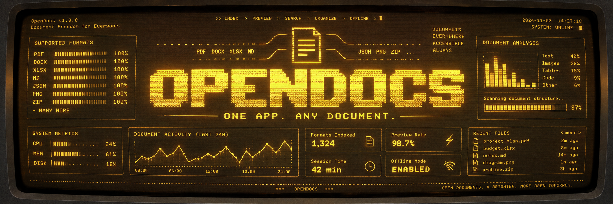

# OpenDocs

**One app. Any document.**



<h1 align="center">OpenDocs</h1>

<p align="center">
  <strong>One app. Any document.</strong>
</p>

<p align="center">
  Universal Document Viewer
</p>

<p align="center">
  Open-source · Offline · Local-first · Cross-platform
</p>

---

## About

OpenDocs is a lightweight universal document viewer designed around one simple idea:

> Drop any file into OpenDocs and something useful should happen.

## Features

- Universal file detection
- PDF, DOCX, XLSX, TXT, Markdown and code preview
- Unknown-file inspection
- Magic-byte detection
- Drag & drop
- Fully offline
- No telemetry
- No cloud

## Support Levels

- **L1 — Native**
- **L2 — Converted**
- **L3 — Extracted**
- **L4 — Inspected**

OpenDocs does not pretend every format can be rendered perfectly.

Instead, unsupported formats gracefully fall back to inspection, metadata and raw-file analysis.

## Security

- JavaScript execution disabled
- Office macros are never executed
- HTML content sanitized
- No automatic script execution
- No external cloud processing

Your files stay on your computer.

## For Developers

Adding a new format is intentionally simple:

```python
@reader("abc")
def read_abc(path):
    ...
```

OpenDocs is designed to remain small enough to understand, modify and contribute to without learning a complex internal framework.

## Version

`v0.1.0 — First Light`

## License

MIT — see the LICENSE file distributed with this source code.

## Philosophy

OpenDocs solves the "one app per format" problem with a minimal, hackable
architecture:

- **Universal detection** — magic bytes + internal structure, never just
  file extension
- **Graceful fallbacks** — when full rendering isn't possible, we extract
  text, metadata, or hex inspection
- **4 support levels** — L1 Native → L4 Inspected, so we can honestly say
  "opens any file" without promising "renders any file"
- **Zero cloud** — everything stays on your computer. No accounts, no
  telemetry, no uploads.

## Supported Formats v0.1

| Level | Format      | Renderer      |
|------:|-------------|---------------|
|   L1  | PDF         | Qt QPdfView   |
|   L1  | TXT / MD / JSON / Code | Native text |
|   L1  | PNG / JPEG / WebP / GIF / SVG | Qt Image |
|   L1  | XLSX        | openpyxl      |
|   L2  | DOCX        | Mammoth → HTML|
|   L3  | ZIP / TAR   | Archive listing|
|   L4  | Unknown     | Hex/strings inspector |

## Installation

```bash
# Clone
git clone https://github.com/fagonezy/opendocs.git
cd opendocs

# Create a virtual environment (recommended)
python -m venv .venv
source .venv/bin/activate  # Windows: .venv\Scripts\activate

# Install dependencies
pip install -r requirements.txt

# Run
python main.py
```

Or download pre-built executables from the [Releases] page.

## Usage

```bash
# Open a specific file
opendocs documento.pdf

# Drag & drop a file onto the window
# Or double-click the Drop area and browse
```

## Architecture

The project consists of exactly 7 files:

```
opendocs/
├── main.py          # Entry point — QApplication loop + CLI args
├── readers.py       # Detector, registry, readers, DocumentResult
├── ui.py            # PySide6 GUI — drop area + preview + status
├── requirements.txt # Runtime dependencies
├── README.md        # Documentation
├── LICENSE          # MIT (or your preferred OSI-approved license)
└── banner.svg       # Project banner (vector, GitHub-friendly)
```

Adding a new format is as simple as:

```python
@reader("new_format")
def read_new_format(path):
    return DocumentResult(...)
```

No framework internals, no base classes to implement — just register a
function.

## Security

- No JavaScript execution in documents
- No macros ever executed
- HTML from DOCX is sanitized (Mammoth messages are inspected, `javascript:` links require confirmation)
- Archive unpacking has size limits to prevent ZIP bombs
- All parsing runs with timeouts and memory limits

## Roadmap

- **v0.1** — Universal detection, PDF, DOCX, XLSX, Text, Images, Archives, Unknown inspector
- **v0.2** — EPUB, ODT, improved PDF, tabs, recent documents
- **v0.3** — Search, document outline, metadata inspector
- **v1.0** — Stable format API, plugin system

## License

MIT — see the LICENSE file distributed with this source code.